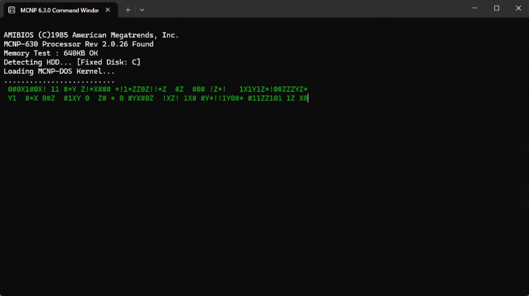
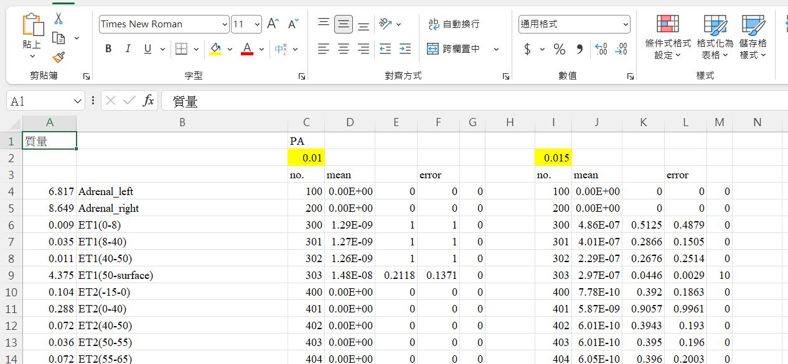

# MCNP-Automation-Toolkit 🚀

[](https://opensource.org/licenses/MIT)
[]()
[]()
[]()
[](https://github.com/10809104/MCNP-Automation-Toolkit/actions/workflows/python-lint.yml)
[](https://github.com/10809104/MCNP-Automation-Toolkit/actions/workflows/c-build.yml)

**MCNP6 高效能全自動化工作流套件：串聯「資源感知的任務調度」與「極速數據後處理」。**

---

## 🌐 Language / 語言選擇
- [**English Description**](./README.md)
- [**中文說明文件**](./讀我.md)

---

## 🌟 為什麼選擇此工具？

執行 MCNP 模擬通常伴隨著繁瑣的手動操作：為了避免當機必須時刻盯著系統資源、手動整理堆積如山的輸出檔案，以及機械式地提取 Tally 數據。

**MCNP-Automation-Toolkit** 透過雙引擎架構消除這些苦差事：

* **Orchestrator 排程器 (Python)** – 智慧管理硬體資源並排程任務，確保模擬時電腦依然流暢不卡頓。
* **Data Parser 解析器 (C)** – 以極速解析海量數據，將雜亂的 `.o` 檔轉化為整齊的試算表。

無論你只有一個案例還是上百個，這套工具能讓你專注於科學研究，而非瑣碎的雜務。

---

## 📦 核心模組

| 組件 | 開發語言 | 功能描述 |
| --- | --- | --- |
| **[Runner / Orchestrator](./Runner/README.md)** | Python | 監控 CPU/RAM、管理任務佇列、啟動 MCNP 實例，並在等待時提供復古風格的儀表板。 |
| **[Data Parser](./Parser/README.md)** | C | 掃描 GB 級別的 `.o` 檔，將 Tally 結果與你的 `source.csv` 對齊，產出整合後的 CSV 報表。 |

這兩個工具可以獨立使用，也可以串聯起來達成全自動的工作流。

---

## 🚀 快速開始

### 1️⃣ 複製儲存庫

```bash
git clone https://github.com/10809104/MCNP-Automation-Toolkit.git
cd MCNP-Automation-Toolkit

```

### 2️⃣ 編譯 C 解析器 (選配 – 亦可直接使用編譯好的執行檔)

```bash
cd Parser
gcc -o MCNP_Parser.exe main.c -lcomdlg32 -lshell32 -lgdi32 -lwininet -lurlmon -lshlwapi

```

> **提示**: 你可以跳過此步驟，直接從 [Releases](https://github.com/10809104/MCNP-Automation-Toolkit/releases) 頁面下載 `MCNP_Parser.exe`。

### 3️⃣ 安裝 Python 依賴 (若從源碼執行)

```bash
cd ../Runner
pip install -r requirements.txt   # 僅需 psutil

```

### 4️⃣ 執行完整工作流

-  **選項 A (源碼)**: 執行 `python MCNP_Runner.py`
-  **選項 B (執行檔)**: 從 Releases 下載 `MCNP_Runner.exe` 並雙擊啟動。

圖形介面將引導你選取：

- MCNP 環境批次檔 (例如：`mcnp_630_env.bat`)
- 包含 `模型參數` 的工作目錄
- 指定要執行的輸入檔案
- CPU 與 RAM 的使用限制

**當所有模擬完成後，你可以執行 `MCNP_Parser.exe`**

圖形介面 會引導你：

- 可以點擊 **HELP** 以了解所需的檔案結構與擺放方式
- 選擇原始 CSV 檔案
- 選擇包含 `.o` 輸出檔的資料夾
- 處理完成後，選擇是否將結果合併為單一 `.xlsx` 檔案

---

## 📂 專案結構

```
MCNP-Automation-Toolkit/
├── Runner/                     # 排程器 Python 原始碼
│   ├── MCNP_Runner.py          # 主程式入口
│   ├── requirements.txt        # Python 依賴清單
│   └── README.md               # 模組專屬說明
│
├── Parser/                      # 解析器 C 原始碼 (為 Dev-C++ 調整之扁平結構)
│   ├── main.c                  # 主程式
│   ├── config.h                # 設定標頭檔
│   ├── tools.h                 # 核心解析函數
│   ├── merge.ps1               # Excel 整合用 PowerShell 腳本
│   ├── MCNP_Parser.dev         # Dev-C++ 專案檔
│   ├── MCNP_Parser.ico         # 應用程式圖示 (選配)
│   ├── MCNP_Parser.rc          # 圖示資源設定
│   ├── version.txt             # 自動更新版本標註
│   └── README.md               # 模組專屬說明
│
├── Examples/                    # 執行截圖與範例輸出
│   ├── runner_demo.png
│   ├── parser_demo.png
│   └── sample_report.csv
│
└── 讀我.md                    # 本檔案

```

> **Dev-C++ 使用者說明**: 所有 C 源碼皆放置於同目錄 (`Parser/`) 下以利 Dev-C++ 專案直接讀取。只需開啟 `main.c` 即可進行編譯。

---

## 🖼️ 範例展示

### 排程器執行畫面


*復古風格儀表板：即時顯示執行任務與資源佔用狀態*

### 解析器輸出結果


*乾淨且對齊的 CSV 輸出，方便後續數據分析*

---

## 📜 授權條款

本專案採用 MIT 授權條款 – 詳見 [LICENSE](LICENSE) 檔案。

> **開發者筆記**: 本套件源於實際的核能工程研究需求。程式碼中可能存在中英夾雜的註釋 — 這是其實戰歷練 (Battle-tested) 的印記。

---

關於 `Parser/` 模組的更多細節，請參閱 [MCNP-Data-Toolkit](https://github.com/10809104/MCNP-Data-Toolkit/)。

**現在就開始自動化你的 MCNP 工作流吧！** *Made with ❤️ by KikKoh*
